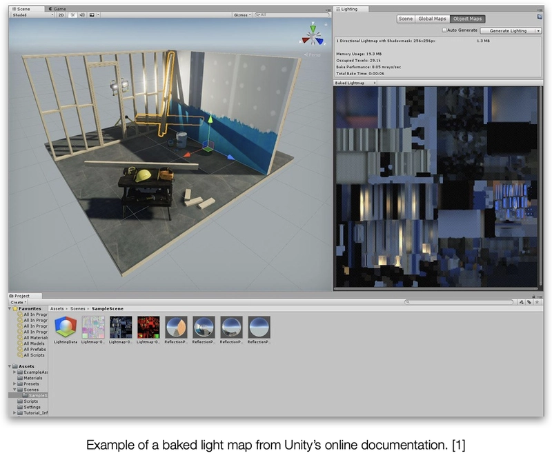
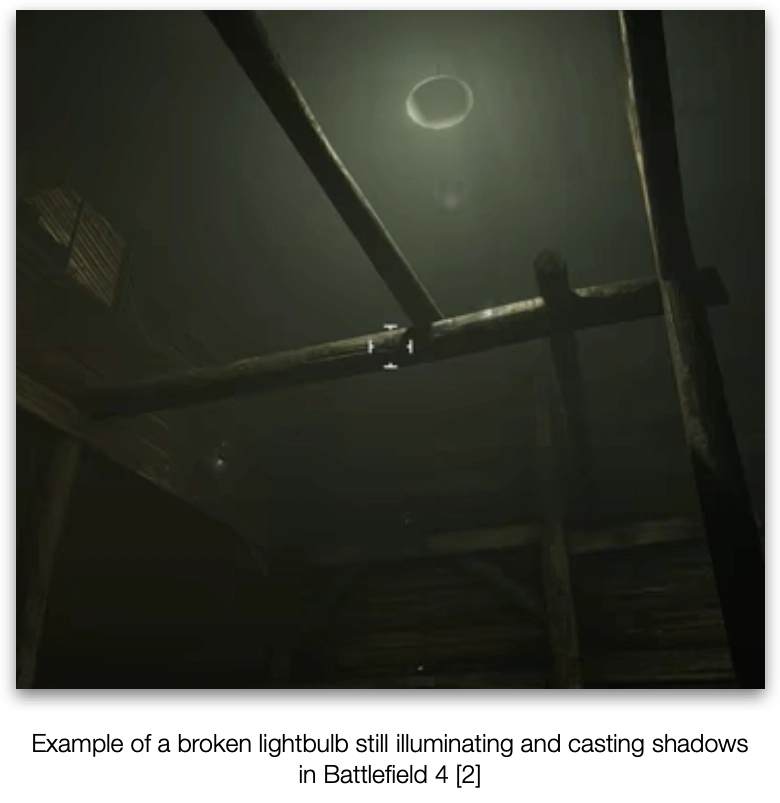
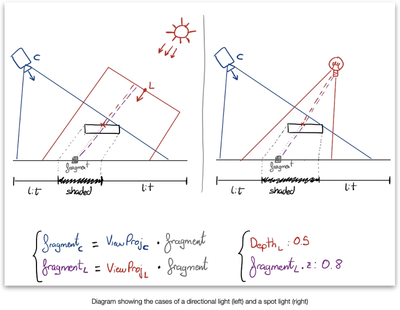
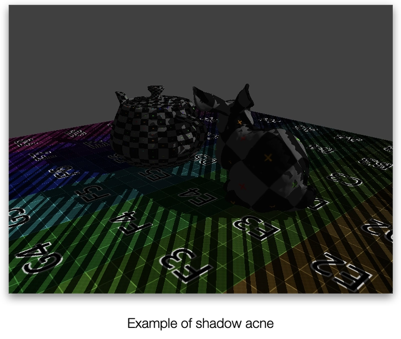
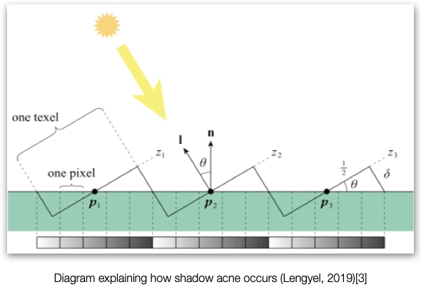
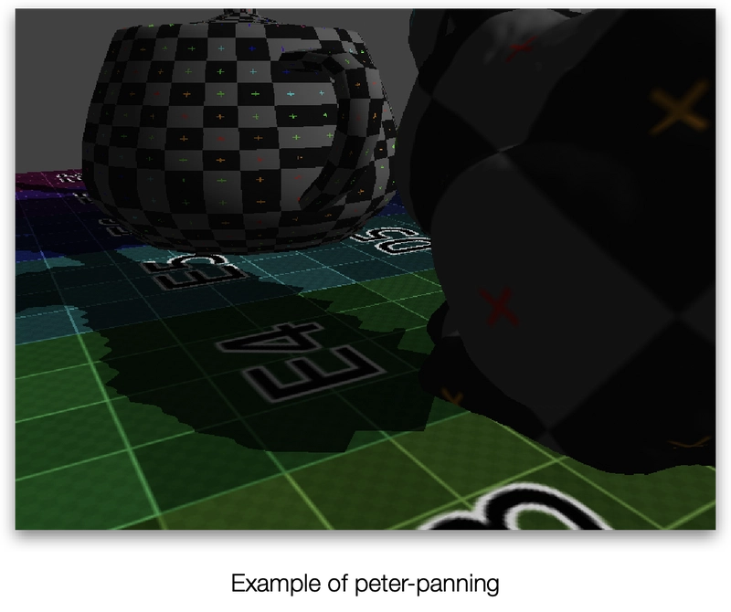
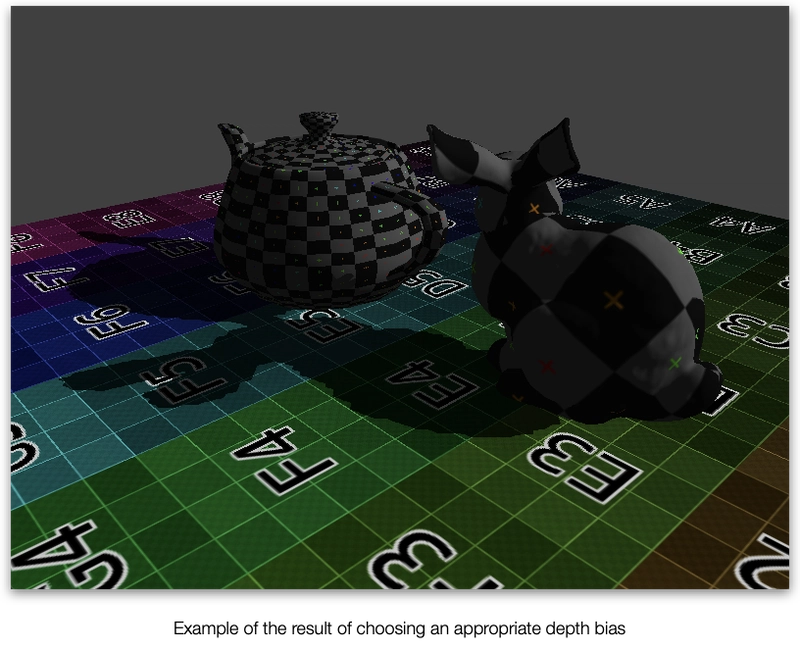

## Rendering Shadows in Real-Time Applications (Part 1)

Rendering shadows on Real Time Applications presents distinct challenges compared to their offline counterparts. On Offline ray/path-traced applications, shadows come “for free” as part of the rendering algorithm but for real time we normally need to rely on physically inaccurate, multi-pass techniques.

On this series of articles, I'll explain different ways we can achieve this.

I would classify the most common techniques in the following way, depending on use case and type of light:

- Static
  - Baked Light Maps
- Dynamic
  - Shadow Maps
      - Directional and spot lights
          - Single
          - Cascaded
      - Point Lights
      - Cube
  - Stencil Shadows

In any case, all these techniques involve generating one or multiple textures with the shadow information that will be sampled in the lighting pass to determine if a fragment is in shadow or not.

Let's start with static shadows.

### Baked Light Maps

If we know for sure that the light sources and the shadow-casting objects are not going to change, we can use the power and simplicity of our offline cousins and create a baked light map.
This would have the extra benefit of providing high quality lighting information as well, although we could bake just the shadows if we want to.

To bake a light map we ray/path trace the scene from each light, adding the contribution of each ray to one or many textures that map every static object of the scene, and will be stored on disk after we’re finished.
Later, when we render the scene, for each static object, we simply sample the texture(s).


This of course would require us to organise the scene into a hierarchy that allows not only the ray/path tracing algorithm to work, but also to map each static surface to a unique region of the texture, and in a way that the texture coordinates can be retrieved during rendering.
This technique will provide the highest quality and most physically correct shadows as we’re simulating the light rays bounces around the scene, but won’t be applied to moving or changing objects, which can create visually incoherent issues if not handled properly.


This technique is also the cheapest at runtime, since it only requires sampling a single texture.

It could also be combined with other real time techniques to be able to use dynamic light sources such as flashlights or vehicle headlights, or to add shadows for moving objects.

**I’d choose this technique if**:
- The environment and main shadow-casting light sources are static.
- You want the highest quality and most realistic shadows possible.
- You want to reduce the number of real-time shadow-casting light sources while keeping the shadows they cast on the environment.
- And/Or you want a high number of shadow-casting lights

An example of an *ideal* game for this technique would be a photo-realistic first person walking simulator in a space ship.

**I’d avoid it if**:
- You have a changing environment:
  - Trees moving with the wind
  - Destructible structures
  - User-built structures
- The shadow-casting light sources change color, position or intensity over time:
  - Day-night cycle
  - Flickering or switchable lights


### Dynamic Shadows
All dynamic shadow maps are essentially the same technique, simply changing the number of maps, the positioning of the lights’ views and the blending between maps (if there’re more than 1), but they have different use cases and greatly vary in complexity.

They also share the same limiting fact: each shadow-casting light source will need to render and apply its own shadow map.
This greatly limits the number of shadow-casting lights present in a scene, since each one implies rendering the scene [1,N] times from different viewpoints. This makes them a good fit for other techniques such as bindless rendering.

#### 2D Shadow Maps
The main problem on rasterised real-time applications regarding shadows is that, at a given fragment, we don’t know anything else about the rest of the object or the scene so initially it’s not possible to know if the fragment is illuminated or not.

A smart way to bypass this limitation of information is to check against what the light “sees”:
If a fragment is visible from the camera, but not from the light, it means something else is in between the light and the fragment, so (for that particular light) it’s shaded.
But, how do we know that?

We can easily transform the fragment’s position to the light’s coordinate space if we create a view matrix for the light. The z/depth of that transformed fragment would be the depth from the light if nothing was in between the two.
If we now sample the light’s depth buffer at that fragment’s coordinates and it’s smaller we know something else got rendered on top of it, so it’s shaded.

Of course, this means we need to render the scene from the light’s perspective first, so we can get the depth buffer. This is the reason why this technique can get very expensive very quickly if we have too many shadow-casting lights.



This is a perfect technique for spot lights like flashlights, headlights or floodlights but it also works for directional lights, as long as the covered area is small.

The general steps to follow are:
 1. Create a new texture and bind it as the depth attachment of a new render pass

 2. Bind the light matrix as the view and a perspective or orthogonal matrix as the projection (it’ll be perspective or orthogonal depending on the type of light). 

 3. Render the scene. We can skip non-shadow-casting objects and the fragment stage, since we only want the depth buffer. (Keep in mind some objects like cloud billboards might need to have back-face culling disabled or flipped) 

 4. Bind light’s view and projection matrices (you can pre-multiply them) as/inside a buffer for the vertex stage.

 5. Bind the now filled depth buffer as a regular texture for the fragment stage. 

 6. Render the scene normally with the following additions to the shaders:

In the **vertex shader**, the output now must include the transformed position of the vertex.

```c++
vertexOut.PositionInLightSpace = lightViewProj * object.model * vertex.position
```

The **fragment shader** on the other hand will use the interpolated position in light clip space to sample the shadow map.
First, the position needs to be normalised. That requires:

- Transforming it into device space by dividing it by the w component (perspective divide)
- Transform it into the [0,1] range (this will depend on the projection matrix and device coordinate space chosen)

Finally, the x and y components can be used to sample the shadow map, and the z component can be used to compare agains that result. If the fragment depth (z component) is greater than the shadow map’s it means the fragment was not visible from the light, and thus it’s in the shade.

```c++
float ComputeShadow(float4 position, texture2d<float> shadowMap)
{
    constexpr sampler smp(min_filter::linear,
                          mag_filter::linear,
                          s_address::clamp_to_border,
                          t_address::clamp_to_border);

    // Transform from clip to device coordinate system.
    // Orthographic projection matrices don't need this.
    auto lightCoords = position / position.w;

    // Normalise the coordinates.
    // Depends on the projection matrix and device coordinate
    // system.
    lightCoords.xy = (lightCoords.xy + 1) * 0.5;

    auto closestDepth = shadowMap.sample(smp, lightCoords.xy).x;
    auto currentDepth = lightCoords.z;

    return currentDepth > closestDepth ? 1 : 0;
}
```

##### Problems
As it is, this presents an issue known as **shadow acne**:


Shadow acne happens when a single texel of the shadow map covers multiple fragments at the same time. This means they all will compare against a single depth value. That means the surface’s orientation relative to the light can cause some fragments to have different depths for the same shadow map texel, causing the distinct shadow patterns.


We can solve this pushing the shadow map’s depth away from the light by adding a *bias* to `closestDepth` but, if pushed too far, the shadow can appear “detached” from the object. We call that **peter-panning**:


A hardcoded bias however is never going to work for all cases, since it depends on the relative orientation of a fragment with the light. For that reason, multiple techniques to adapt the depth bias to the geometry exist, from simply adjust it according to the angle between the light and normal vectors, to more complex techniques like Receiver Plane Depth Bias (*Isidoro J.R, 2006[4]*) that uses derivatives to calculate how much the depth changes in the neighbouring fragments, or Adaptative Depth Bias (*Ehm et al., 2014[5]*).

Thankfully nowadays APIs provide ways to adapt the depth bias automatically, depending on the gradient of the primitives.
For example, in Metal these values perform quite well:
```swift
commandEncoder.setDepthBias(1, slopeScale: 3, clamp: 1/128)
```
This is applied while rendering the shadow map, so no bias has to be added to the fragment shader.



##### Conclusion

This technique as presented here produces hard shadows. Soft shadows techniques require sampling multiple times the shadow map, which of course will add a certain performance cost depending on the complexity of the filtering done.
This will be covered in future articles.

The main disadvantage of this technique however is that the greater the area lit by the light source, the bigger the shadow map should be. Otherwise, we’ll miss small or far away objects, and the rest of the shadows will lose sharpness.
It’s easy to see how this can become a big issue in terms of memory and bandwidth.
This is particularly bad for directional lights like the Sun when the scene is big. In that case, it’s better to use Cascaded Shadow Maps.

I’d choose this technique for the player's in a first person game, headlights of vehicles, or other spot light sources like floodlights or searchlights.
For directional lights I’d avoid this as a rule of thumb, but it could be used as the sun if the scene is relatively small (or the player’s view distance is limited), or maybe as an approximation for a big area light.


---
### 📚 References

1. [“Lightmapping: Getting Started” (Unity docs)](https://docs.unity3d.com/2018.2/Documentation/Manual/Lightmapping.html)
2. [Battlefield 4 example: “What is Baked Lighting? (Lightmap)”](https://www.youtube.com/watch?v=eGmXDOGjKPA)
3. Lengyel, E. (2019), Foundations of Game Engine Development: Rendering, Terathon Software LLC
4. Isidoro J. R. (2006), Shadow Mapping GPU-based Tips and Techniques, GDC 2006
5. Ehm, A., Ederer, A., Klein, A., & Nischwitz, A. (2015). Adaptive depth bias for soft shadows