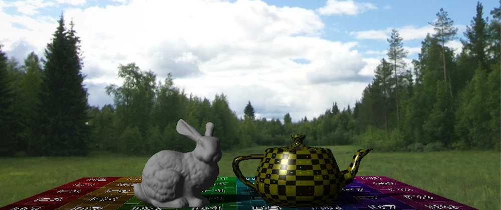
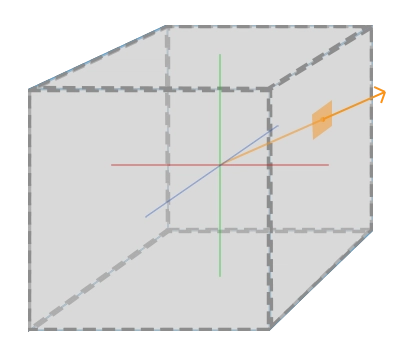
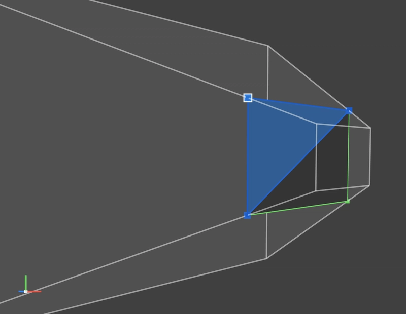
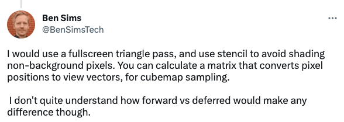
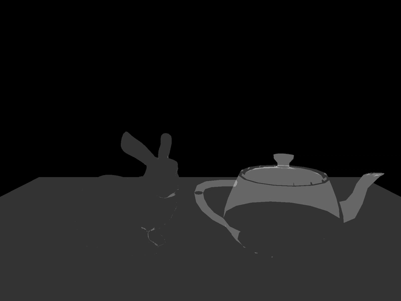

> Article first published in [Dev.to](https://dev.to/javiersalcedopuyo/rendering-a-screen-space-skybox-57ca)


## 🌄 Rendering a Screen-space Skybox

_NOTE: This won't be an article that goes very deep into details, it's more a way to document how I implemented the skybox in my renderer. I use Metal, but it should translate to other APIs almost 1-to-1._

---

When I decided to implement a skybox on [my renderer](https://github.com/javiersalcedopuyo/Talos3D) my first impulse was to follow [the ol' reliable LearnOpenGL article on cubemaps](https://learnopengl.com/Advanced-OpenGL/Cubemaps), which essentially consists on rendering a giant cube around the camera.




It's a simple and very intuitive approach but I wanted something a wee bit fancier. 
Also, this technique requires uploading a lot of data (all the cube's vertices, a new view matrix so it "stays in place" as you move the camera, etc) which wouldn't be necessary on a screen-space approach.

### 📺 Screen-space implementation
For those unfamiliar with the term, screen-space basically means that we render onto a plane (normally a quad or a giant triangle) that covers the whole screen.
If you want to be super efficient you can use a giant triangle but I opted for a quad because it was simpler to set up (I can hardcode the output vertex positions as the corners of the  normalised device coordinates space at the near plane).



The fragment shader will sample the cube texture with the view direction **in world space**.
To get it, I simply multiply the **vertex** position by the inverse view and projection matrices and let the GPU interpolate it.

Normally, in vertex shader we go from object to world, to camera, and finally to clip/device space, but in this case we already have the device coordinates and we need the world's.

```C
// So instead of doing:
device_space_pos = projection * view * model * objec_space_pos;
// We need the inverse transformation, which implies multiplying by the inverse
// matrices, in reverse order:
world_space_pos = inverse(view) * inverse(projection) * device_space_pos;
```

> 🚀 Performance tip:
> Inverting a matrix is an expensive operation, but we can take a shortcut:
> Orthonormal matrices (matrices that don't change the relative position between points) have the convenient property that their inverse is the same as its transpose, which is way easier to compute.
> Thankfully, the view matrix is orthonormal, so we can save some work there. However, the same doesn't apply to the projection matrix and it has to be inverted "properly".

> ℹ️ You could precompute these inverse matrices on the CPU instead of re-calculating them for every vertex, but since there're only 4 vertices (potentially 3), the cost of uploading and binding the extra matrices would probably be higher.

If we render the skybox the first thing in the pass, that'd be it. The skybox will "clear" the render target and everything else would go on top (just remember to disable depth write).
However I wanted to go further and optimise it a bit more.

### 🥱 Avoiding work

I got the idea from this reply to one of my tweets:



It makes a lot of sense!

My test scene only has 3 objects at the moment: the floor, a Stanford Bunny and a Utah Teapot, but a "real" environment will have a lot of things on the screen, and the skybox will take only a small percentage of the render target. Why would we want to calculate the skybox for every single fragment if most of them will get overwritten anyway? And keep in mind that we are doing 2 expensive operations here: inverting a matrix (vertex stage) and **sampling a cubemap (fragment stage)**.
A stencil is the perfect fit.

In this case we don't need anything fancy, we just need to know if that fragment is "free". So what I did was:

1. Move the skybox draw call to **the end** of the scene pass.
2. For every scene object, increment the stencil when a fragment is drawn.
3. When rendering the skybox, only draw the fragments that still have a stencil of 0.

This is how my stencil looks at the end of the pass:


The skybox fragment shader will only run for the pixels in black, saving a lot of computing.

To achieve this in the code I had to:
1. Change the Z buffer format to include stencil
2. Create 2 separated stencil states. One for the scene rendering, and another for the skybox.
```swift
mainStencilDesc.depthStencilPassOperation   = .incrementClamp
mainStencilDesc.stencilCompareFunction      = .always

// Only render the skybox for the fragments that have the same stencil value as the reference
skyboxStencilDesc.stencilCompareFunction    = .equal
```
2.1 BONUS: Disable depth writing and testing for the skybox. It's not 100% necessary because the quad will be so close to the camera that it'll always pass, but it has a cost that we can easily avoid.
```swift
skyboxDSDesc.frontFaceStencil       = skyboxStencilDesc
skyboxDSDesc.isDepthWriteEnabled    = false
skyboxDSDesc.depthCompareFunction   = .always
```

3. Swap the states and set the reference value
```swift
...
// All other scene draw call encoding
...
cmdEncoder.setDepthStencilState(skyboxDepthStencilState)
cmdEncoder.setStencilReferenceValue(0);
// Encode the skybox draw call
...
```

Et voilà! 


---

### 🧑‍🏫 Conclusions
#### 😄 The good
- Pretty simple to implement.
- Ridiculously small bandwidth cost: This approach only requires us to upload the cubemap and 4 vertices (3 if we used a triangle) that don't really need to carry any information. We could even just upload a point and generate the quad in the geometry stage. The cubemap can (and will) be used for other techniques so it's not really an extra cost and it can stay bound, it uses the same view and projection matrices so we don't need to bind any, and it uses the same attachments as the rest of the scene so it can stay in the same pass.
- The most expensive part (cubemap sampling) is only done where it's stricly necessary.

#### 😭 The bad
- Not as "intuitive" as the giant cube approach?

#### 👹 The ugly
- I spent more time than what I'm proud to admit debugging a "lense distortion" and doubting my math and graphics knowledge. Turns out it was caused by me "inverting" the projection matrix by transposing it, despite it not being orthonormal.
- Managing the depth-stencil state can be annoying in some graphic APIs?
