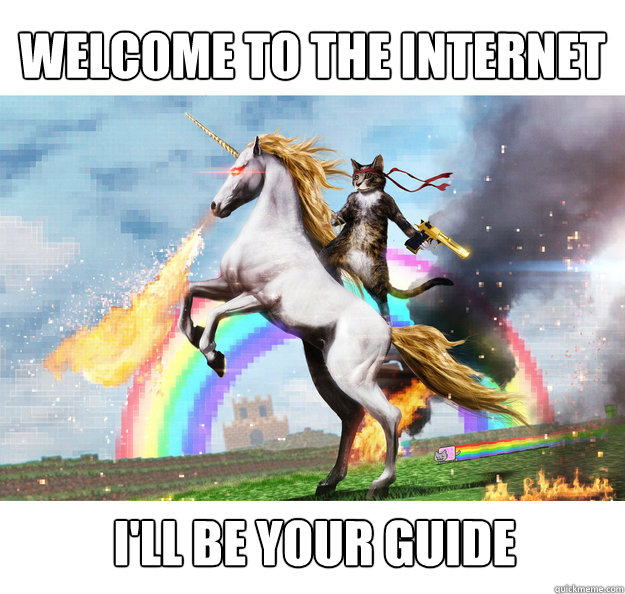

# I ❤️ Online
This is a continuation to my [I ❤️ Offline](https://javiersalcedopuyo.xyz/blog/2025/I_love_offline.html) article.
That article can be summarized as this:
- I don't like asking for permission to do things on my devices (even creating an account).
- I don't like having to fire up a whole web browser for simple tasks that do not need to consume that many resources (that includes Electron apps).

But I like to stay connected, get the latest news, and discover new music.

Nowadays, with social media, the "enshittification" of streaming platforms, mass surveillance, and general poor quality software over-reliant on a browser/internet connection, it's very easy to hate on the Internet, and online tools. I've definitely done it.
And lately, I started to really dislike algorithmic feeds. Not because they're bad, but because they're *too good*. I end up wasting way too much time on YouTube/Twitter, precisely because they perfectly know how to keep me hooked.

The Internet is still a wonderful, almost magical thing. And there are still a lot of ways to stay connected to the rest of the world that respect your privacy, time, and intelligence.
This is a humble love letter to some of them.

## News

RSS (And Atom. I see you, pedantic nerds) is an absolute miracle for the free press.
Both on text and audio (podcasts), they represent something that would not have been even in the wildest dreams of the philosophers of centuries past.

The radio changed the world in such a way that it's hard to comprehend from today.
Suddenly *anyone* could listen to the latest music, news, interviews, or political speeches. No one could stop or track them.
Once it was on the airwaves it couldn't be stopped.

But the frequency spectrum is limited, and stations are trivial to track down. So, with the exception of a few of pirate stations, the flow of information was still easy to control from the source.

The Internet, RSS, and nowadays federated platforms, are the fulfilment of a dream that started almost six centuries ago with the printing press.

*Anyone* can publish *anything* and *anyone else* can stay up to date.
*Anyone* can interview *anyone*, ask them about *anything*, for *as long* as they want.
No need to fight for limited air time, radio frequencies, or print space. Nor to tread around the interests of the station or newspaper owner, be it a business tycoon, a university board, or a government.

And you can access all of that, *for free* and *anonymously*, from *anywhere*. No permission nor registration required.
The protocols are old and simple, the data is lightweight (for modern standards), and there are a myriad clients on every platform. If you have a device that can connect to the Internet, you can access the information.
Setting up your own feed is also extremely simple. It's also trivial to duplicate and to transplant to another server if needed. It's censorship-~~proof~~*resistant* by its own nature.
A perfect example of [File Over App](https://stephango.com/file-over-app).

I could go on a very similar rant about P2P document sharing protocols like BitTorrent, Ares, or Kad.

## Communications
On a similar note, even things like emails and IRC would seem like straight up witchcraft for all of human history until just some decades ago. Imagine stuff like video calls. *"What do you mean you can instantly talk with someone on the opposite side of the world?"*

Chat apps are trickier because they are very hard to get right as a decentralised system, and they suffer greatly from network effects. But still, there're plenty of at least somewhat private and free options out there like [Signal](signal.org), [Telegram](telegram.org), even WhatsApp is supposed to be E2EE these days...
I'd love to love [Matrix](matrix.org), too. But, in my limited experience, the UX is still not fully there, and it suffers a lot from being a niche tool.

## Music and Entertainment
Music streaming was the main reason I got proper mobile data for the first time.
I remember being incredulous the first time I saw Spotify (back when it was invitation-only): I was convinced it had to be illegal (like a fancier wrapper UI for eMule) and wouldn't last long.
For younger people who never knew the days before instant and quasi unlimited access to music I imagine it's hard to comprehend how much of a big deal this was.
Same for YouTube, and Netflix.

I won't get into the current state of streaming platforms, but I'll just say that I'm buying physical movies and series again, and I'm currently researching self-hosted media tools like [Jellyfin](jellyfin.org). However, I don’t see myself fully abandoning music streaming. It's still too good, and too convenient.

I still want to mention another wonderful thing the Internet brought, and that nowadays is kind of forgotten, but very much alive: *online radio*.

I like to listen to background music while I work, but nothing too distracting. So a lot of lofi, classical, synthwave... The problem I quickly encountered was that those genres fully dominated my listening history, and the recommendation algorithms stopped recommending the music I *really* want to discover and explore.
So now I have a personally curated list of internet radio stations, just for that. Most desktop music players can open streams without any trouble, so I just keep them in a `.m3u` file (file over app again).
I use different apps for each platform though:
- [Shortwave](https://apps.gnome.org/Shortwave/) on Linux
- [Radio Buddy](https://apps.apple.com/us/app/radio-buddy/id457176694) on macOS and iOS
- Just good old [Audacious](https://audacious-media-player.org/) on Windows
If you want to search and discover new stations, [this](https://www.radio-browser.info/) is the database used by most apps (and it has a player built in).

If you don't mind manually building your offline music library like it's 2005, this is also a great way to replace the recommendation algorithms of streaming platforms. The way it used to be, really. I have discovered a bunch of bands this way that were never in my streaming recommendations.
