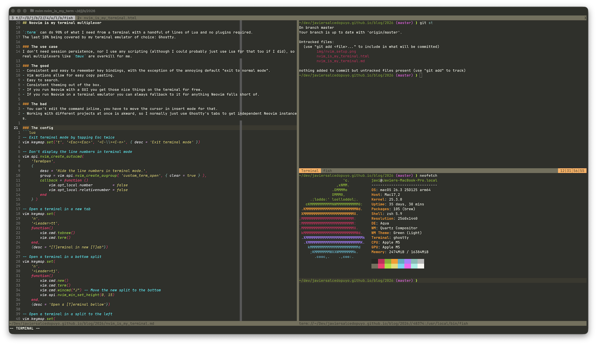

## Neovim is my terminal multiplexer



`:term` can do 90% of what I need from a terminal with a handful of lines of Lua and no plugins required.
The last 10% being covered by my terminal emulator of choice: [Ghostty](https://ghostty.org/).

### The use case
I don't need session persistence, nor I use any scripting (although I could probably just use Lua for that too if I did), so real multiplexers like `tmux` are overkill for me.

### The good
- Consistent and easy to remember key bindings, with the exception of the annoying default "exit to normal mode".
- Vim motions allow for easy copy pasting.
- Easy to search.
- Consistent theming out of the box.
- If you run Neovim with a GUI you get those nice things on the terminal for free.
- If you run Neovim on a terminal emulator you can always fallback to it for anything Neovim falls short of.

### The bad
- You can't edit the command inline, you have to move the cursor in insert mode for that.
- Working with different projects at once is akward, so I normally just use Ghostty's tabs to get independent Neovim instances.

### The config
```lua
-- Exit terminal mode by tapping Esc twice
vim.keymap.set('t', '<Esc><Esc>', '<C-\\><C-n>', { desc = 'Exit terminal mode' })

-- Don't display the line numbers in terminal mode
vim.api.nvim_create_autocmd(
    'TermOpen',
    {
        desc = 'Hide the line numbers in terminal mode.',
        group = vim.api.nvim_create_augroup( 'custom_term_open', { clear = true } ),
        callback = function ()
            vim.opt_local.number         = false
            vim.opt_local.relativenumber = false
        end
    } )

-- Open a terminal in a new tab
vim.keymap.set(
    'n',
    '<Leader>tt',
    function()
        vim.cmd.tabnew()
        vim.cmd.term()
    end,
    {desc = "[T]erminal in new [T]ab"})

-- Open a terminal in a bottom split
vim.keymap.set(
    'n',
    '<Leader>tj',
    function()
        vim.cmd.new()
        vim.cmd.term()
        vim.cmd.wincmd("J") -- Move the new split to the bottom
        vim.api.nvim_win_set_height(0, 15)
    end,
    {desc = 'Open a [T]erminal bellow'})

-- Open a terminal in a split to the left
vim.keymap.set(
    'n',
    '<Leader>th',
    function()
        vim.cmd.new()
        vim.cmd.term()
        vim.cmd.wincmd("H") -- Move the new split to the left
    end,
    {desc = "Open [T]erminal to the left"})

-- Open a terminal in a split to the right
vim.keymap.set(
    'n',
    '<Leader>tl',
    function()
        vim.cmd.new()
        vim.cmd.term()
        vim.cmd.wincmd("L") -- Move the new split to the right
    end,
    {desc = "Open [T]erminal to the right"})


-- Open a terminal in a top split
vim.keymap.set(
    'n',
    '<Leader>tk',
    function()
        vim.cmd.new()
        vim.cmd.term()
        vim.cmd.wincmd("K") -- Move the new split to the top
        vim.api.nvim_win_set_height(0, 15)
    end,
    {desc = 'Open a [T]erminal above'})
```
